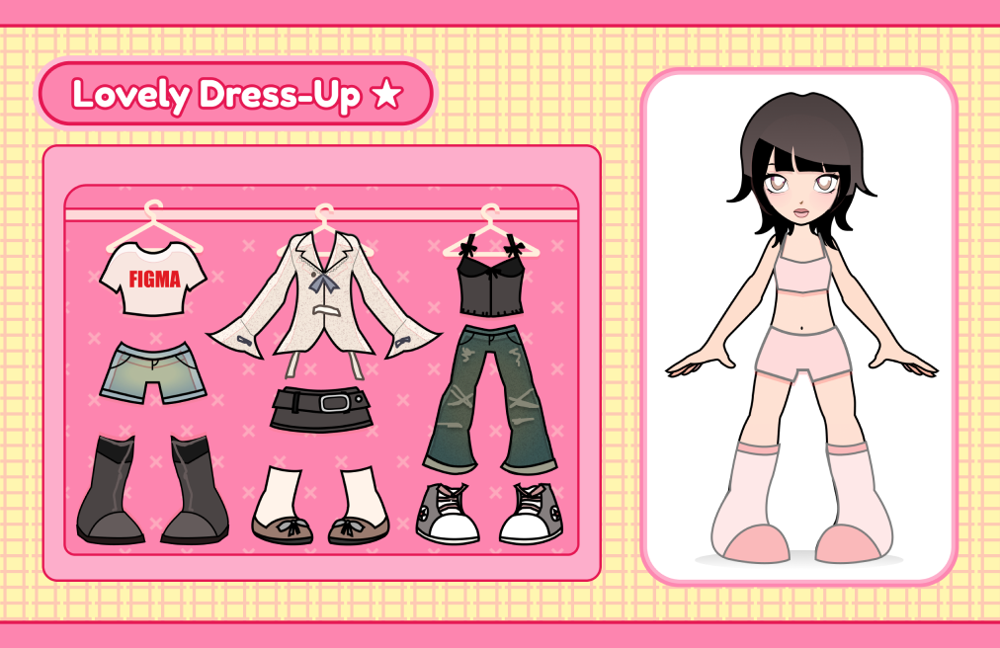

# Drivfar Dress Up



## Minimum Viable Product

MVP:n är ett enkelt “dress-up”-spel där spelaren skapar en outfit och får den automatiskt bedömd.

Spelet består av en enkel figur (en “gubbe”) där spelaren kan välja olika plagg. Minst fyra klädkategorier finns: tröja, byxor, skor och hatt. Dessa ska spegla studentlivet, till exempel plagg som overall (ovve), frack och KTH-hoodie. När spelaren väljer ett plagg placeras det automatiskt på rätt del av figuren (t.ex. tröja på överkroppen).

Alla plagg har initialt en neutral färg (t.ex. vit). Spelaren kan sedan ändra färgen på plagget genom att välja från en palett. Ett begränsat antal mönster kan finnas, men mönster är inte nödvändigt för MVP:n.

När spelaren är nöjd med sin outfit trycker den på en knapp (t.ex. “OK”). Spelet kör då ett automatiserat betygssystem. Systemet analyserar färgkombinationerna mellan plaggen och hur väl de matchar varandra; exempelvis hur väl färgerna passar temat, eller färgharmoni. Det kan även kontrollera enkla typkombinationer mellan plagg (t.ex. hur väl olika klädtyper passar tillsammans).

Resultatet visas som ett betyg (t.ex. S/A/B/C eller poäng) tillsammans med en kort kommentar, till exempel “Snygg färgmatchning!” eller “Modigt, men lite mycket.”

Grafiken i MVP:n behöver inte vara avancerad. Enkla ritade former eller grundläggande sprites räcker. Spelet behöver inte spara outfits eller ha multiplayer. Eftersom spelet planeras kunna köras i sektionens arkad ska det fungera som ett kort arkadspel: spela en runda, få ett betyg, och börja om.

## Teknik och plattform
Vi kommer att skriva i programmeringsspråket C och använda biblioteket CSFML (som är den officiella C-bindningen till SFML). SFML lämpar sig bra för att utveckla ett mindre 2D-spel eftersom biblioteket ger färdiga lösningar till att öppna fönster, rita sprites och former samt att det är plattformsoberoende. Det är även möjligt att lägga till eventuella ljudeffekter eller musik. Vidare valde vi att vi ska utveckla projektet i just C för att det inte är ett språk vi använt mycket tidigare, och därför vill lära oss mer om. Spelet utvecklas i första hand för desktop, med fokus på att kunna köras på den miljö som används för sektionens arkad.

## Byggsystem
Projektet kommer använda Make som byggsystem för att kompilera och länka programmet. Det här är nödvändigt då vi vill att vårt spel ska kunna kompilera på olika operativsystem. Utvecklingen av byggsystemet förväntas vara en av de mer krävande delarna av projektet, bland annat då man behöver läsa på en hel del för att kunna bygga byggsystemet. Det är också något som behövs innan vi kan komma igång med resten av projektet, så vi kommer prioritera att få klart det så snabbt som möjligt.

## Ytterligare features om tid finns
- Ljud: musik och SFX
- Fler klädkategorier, till exempel accessoarer (glasögon, halsduk, ryggsäck), flera lager?
- Fler studentrelaterade plagg, exempelvis sektionskläder eller olika typer av overaller.
- Mönstersystem där spelaren kan välja olika mönster på kläderna (t.ex. ränder eller prickar) och där betygssystemet även analyserar mönsterkombinationer.
- Mer avancerad outfit-bedömning som tar hänsyn till färgharmoni (t.ex. komplementfärger eller färgpaletter).
- Teman eller utmaningar, till exempel “Gasque-outfit”, “Tentaplugg”, eller “Valborg”. Spelaren försöker då få en outfit som passar temat.
- Highscore-system för arkadversionen där spelare kan slå tidigare poäng under samma session.
- Animationer eller mer detaljerad grafik för figuren och plaggen.
- Slumpade plagg eller “mystery mode” där spelaren måste skapa en outfit med begränsade val.

## Hur fördelas arbetet?
Arbetet delas upp så att gruppen i första hand kan arbeta parallellt i olika moduler. När beroenden finns mellan delar av systemet används ett mer sekventiellt arbetssätt (“tag-team”), där en person färdigställer en komponent innan nästa tar vid. Om någon ansvarar för en större initial del (t.ex. build system) planeras arbetsbelastningen så att det jämnas ut över projektets gång.

## Projektets moduler (2 mån)
1. Projektstruktur och build system
2. Minimal game loop (öppna/stänga fönster, event loop)
3. Datamodell (representation av klädesplagg, slots, outfit)
4. Parallellt arbete:
    1. Dress logic (välja plagg och applicera på figur), Färgändring (RGB-baserad redigering av plagg)'
    2. Gränssnitt (knappar, palette, etc; fysiska “delar”)
    3. UI-flöde (val av plagg → preview → OK → resultat)
5. Eventuellt "ytterligare funktioner”
6. Refaktorering och stabilisering

## Vem/vilka ska göra vad?
- Build system / projektstruktur: Jonathan
- Betygssättningssystem (logik): Nikolina
- Gränssnitt (UI): Rasmus
- Rendering av kläder på figur: Julina

## Vad förväntas ta mest tid?
- Implementering och finjustering av betygssystemet (särskilt färgmatchning)
- UI-flöde och användarinteraktion
- Integration mellan moduler (t.ex. att rendering, input och logik fungerar tillsammans)
- Eventuell felsökning kopplad till grafik/rendering

## Hur ska arbetet bedrivas?
Projektet utvecklas iterativt med kontinuerliga integrationer via Git. Kod skrivs i mindre delar som regelbundet mergas in i huvudgrenen. Fokus ligger på att ha en fungerande helhet tidigt, som sedan byggs ut stegvis.

## Schemalagda möten och kommunikation
- Ett schemalagt möte per vecka (onsdag morgon/förmiddag.
- Möten används främst för synkronisering och uppföljning
- Löpande kommunikation sker via Discord

## Versionshantering
- Git används för versionskontroll
- Arbete sker i branches med Pull Requests
- Merge sker med rebase för en ren historik
- Vid enklare ändringar kan direkt push till main förekomma

Våra commitmeddelanden formateras på följande vis:
### Sammanfattning
- Den första raden innehåller en sammanfattning på högst 50 tecken.
- Första bokstaven är stor, och raden är utan punkt.
- Använd presens ("Add feature" istället för "Added feature").
- Använd imperativ ("Move cursor to..." istället för "Moves cursor to...") i sammanfattningen.

### Beskrivning
- Om man vill lägga till mer detaljer/kontext så läggs en blankrad till efter sammanfattningen följt av en beskrivning.
- Varje rad får högst vara 72 tecken.

Markdownformatering kan användas.

### Exempel
```
Add color selection widget

Adds a color selection widget to the game view showing a palette of
options. This required changing the implementation of `UiFrame`.
```

### Kodstandard och kvalitet
- Kod formateras med clang-format
- Tydlig dokumentation eftersträvas
- Enkla enhetstester kan implementeras där det är lämpligt (framförallt för logik, t.ex. betygssystemet)